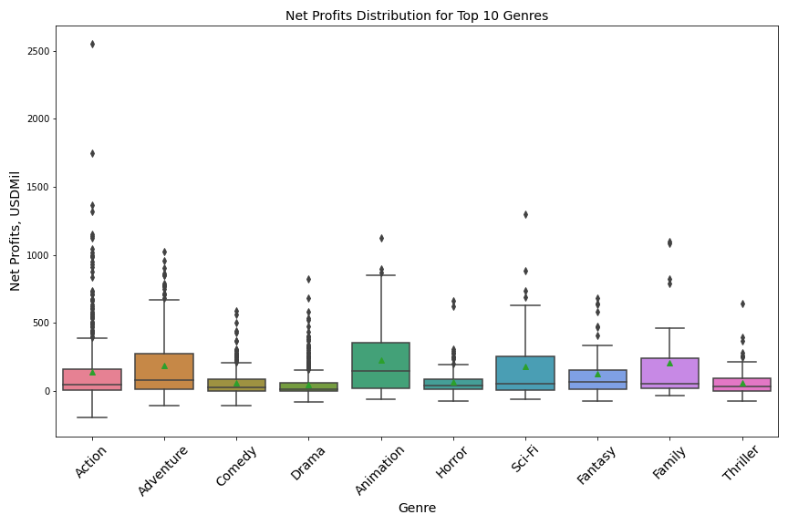
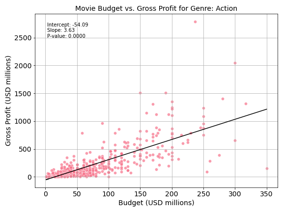
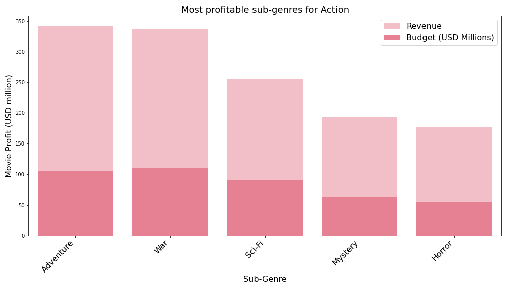

# Project File Tree

    .
    ├── AY_Phase2.ipynb                     Notebook.
    ├── README.md                           Readme.
    ├── extraData                           Additional zipped datasets.
    │   ├── golden_globe_awards.zip
    │   ├── the_oscar_award.csv.zip
    │   ├── movie_metadata_with_R.csv.zip    
    │   ├── tmdb_5000.zip
    ├── movie_data_erd.jpeg                 IMDB ETD diagram.     
    ├── presentation.pdf                    Presentation.
    ├── results                             Plots. 
    └── zippedData                          Provided datasets.
        ├── bom.movie_gross.csv.gz
        ├── im.db.zip
        ├── rt.movie_info.tsv.gz
        ├── rt.reviews.tsv.gz
        ├── tmdb.movies.csv.gz
        ├── tn.movie_budgets.csv.gz

# Readme Structure

    Goals
        * Business Problem
    Data
        * Data Understanding
        * Data Analysis
    Conclusions
        * Recommendations
        * Next Steps
 

## Business Problem

Your company now sees all the big companies creating original video content and they want to get in on the fun. They have decided to create a new movie studio, but they don’t know anything about creating movies. You are charged with exploring what types of films are currently doing the best at the box office. You must then translate those findings into actionable insights that the head of your company's new movie studio can use to help decide what type of films to create.

## The Data

In the folder `zippedData` are movie datasets from:

* [Box Office Mojo](https://www.boxofficemojo.com/)
* [IMDB](https://www.imdb.com/)
* [Rotten Tomatoes](https://www.rottentomatoes.com/)
* [TheMovieDB](https://www.themoviedb.org/)
* [The Numbers](https://www.the-numbers.com/)

In the folder `extraData` are movie datasets from:
In addition, I included the following datasets from Kaggle in `.extraData`:

* [Oscar Awards](https://www.kaggle.com/datasets/unanimad/the-oscar-award)
* [Golden Globe Awards](https://www.kaggle.com/datasets/unanimad/golden-globe-awards)
* [TMDB Dataset](https://www.kaggle.com/datasets/tmdb/tmdb-movie-metadata)
* [IMDB Movies with Content Ratings](https://www.kaggle.com/datasets/shailx/imdb-movie-rating-dataset)

## Data Manupulation.

We start with extracting zipped data and load all available datasets.
We then work our way into creating a dataset with movie genres (at least two), movie budgets, movie gross, cast, crew.

*We'll be using same column naming pattern for all datasets. 
*We'll be splitting genres into two columns for all datasets.
*We'll be adding cast and crew names, crew names will be split into `Director`, `Producer`, `Screenplay`. 
*We'll be filtering all datasets after year 2000. 

->For IMDB database, we create a query that joins `movie_basics` with `movie_person`, adding cast and crew to our dataset.
We then process all movie titles for both IMDB and TheMovieDB (dataset with budgets and profits) into lower-case strings and search for a match using processed movie title and movie year.
We then add columns indicating if cast or crew member received an award (Golden Globe, Oscar) and plot the data.

->With TMDB dataset, we already have budget and gross, so we add cast and crew columns as well as awards columns.

->For Content Rating Dataset, we split genres into separate columns, scale the budgets, unify column naming.  

As a final step, we merge IMDB dataset with TMDB Dataset. 

## Data  Overview.

 
Key Movie Metrics we'll be using for the profit analysis:

    * Budget
    * Duration
    * Release Time
    * Content Rating
    * Subgenres
    * Expected Return
    * Cast
    * Crew
    * Cast or Crew with Awards
        

## Analysis of Action Genre.

###  High entry-level budget.

###  Greater chance of not meeting the ROI >50%. 

 Greater chance of not meeting the ROI >50%. 

### Expected return coefficient for every dollar invested: 3.6.

### Longer movies perform better in box office.

### Movies released in early summer and after Thanksgiving perform better in box office.

### Family-friendly movies perform better in box office.

### Most profitable subgenres are Adventure, Sci-Fi.

### Top 10 cast and crew for Adventure. 

Our recommendations for movies in Action genre:

    || Key Feature          | Recommended Value       |
    |----------------------|--------------------------|
    | Budget               | $50-100 million          |
    | Content Rating       | PG-13                    |
    | Release Time         | Early Summer, Holiday Season |
    | Duration             | 2-3 hours                |
    | Subgenres            | Adventure, Sci-Fi.       |
    | Expected Return Coefficient | 3.6              |
    | Acclaimed Cast       | No                       |
    | Acclaimed Crew       | Yes                      |

## Conclusions.

In this analysis we established 10 most profitable genres. For all genres we demonstrated how selected key movie metrics, like duration, release month, content rating, and having critically acclaimed crew/staff can affect movie profits.
Our recommendations are presented in the extended table.

|    | Genre     |   Median Budget | Recommended Subgenres                           | Recommended Content Rating   | Recommended Months           | Recommended Duration      | Recommended Cast                                                                                                                                                           | Recommended Directors                                                                                                                                            | Recommended Writers                                                                                                                                                                                   | Recommended Producers                                                                                                                                               |   Expected Return | Expected Return with Cast Awards   | Expected Return with Crew Awards   |
|---:|:----------|----------------:|:------------------------------------------------|:-----------------------------|:-----------------------------|:--------------------------|:---------------------------------------------------------------------------------------------------------------------------------------------------------------------------|:-----------------------------------------------------------------------------------------------------------------------------------------------------------------|:------------------------------------------------------------------------------------------------------------------------------------------------------------------------------------------------------|:--------------------------------------------------------------------------------------------------------------------------------------------------------------------|------------------:|:-----------------------------------|:-----------------------------------|
|  0 | Action    |           50    | Adventure, War, Sci-Fi, Mystery, Horror         | PG-13                        | December, June, May          | 161-180, 141-160, 121-140 | Michelle Rodriguez, Robert Downey Jr.,  Dwayne Johnson, Vin Diesel,  Chris Hemsworth,  Zoe Saldana,  Mark Ruffalo, Tom Cruise,  Samuel L. Jackson,  Jordana Brewster       | *Christopher Nolan, *James Cameron, James Wan,  Joe Russo, Anthony Russo, *Brad Bird, Roland Emmerich, Zack Snyder, Rian Johnson, *Christopher McQuarrie         | ,  Derek Connolly,  Stephen McFeely, Jack Kirby, *James Cameron, *Christopher Nolan,  Stan Lee,  Chris McKenna,  Erik Sommers,  Colin Trevorrow                                                       | Kevin Feige, Charles Roven, Michael Fottrell,  Neal H. Moritz,  Emma Thomas,  Jon Landau, *James Cameron, Frank Marshall,  Bryan Burk,  Patrick Crowley             |           3.62526 | 3.4117907189027465                 | 7.302632565781717                  |
|  1 | Adventure |           77    | Thriller, Fantasy, Action, Family, Animation    | PG-13                        | May, November, June          | >200, 161-180, 141-160    | Orlando Bloom,  Alan Rickman,  Rupert Grint, Daniel Radcliffe,  Emma Watson,  Robbie Coltrane,  Ian McKellen,  Tom Felton, Johnny Depp,  Maggie Smith                      | *Peter Jackson, *Gore Verbinski, Andrew Adamson, David Yates, Chris Columbus, *Steven Spielberg,  Eric Guillon,  Pierre Coffin, Kyle Balda, Mike Newell          | Fran Walsh,  Philippa Boyens, *Peter Jackson, Steve Kloves, ,  Terry Rossio, Ted Elliott, Melissa Rosenberg,  Stephen McFeely, Andrew Adamson                                                         | David Heyman, Jerry Bruckheimer,  Peter Jackson, Barrie M. Osborne, Karen Rosenfelt,  Carolynne Cunningham,  Wyck Godfrey,  Fran Walsh, *Peter Jackson, Kevin Feige |           3.07241 | 3.317416449226497                  | 2.7724471438362843                 |
|  2 | Comedy    |           25    | Animation, Fantasy, Adventure, Family, Music    | G                            | December, May, July          | 121-140, 101-120, 80-100  | Justin Long,  Jane Lynch,  Christina Applegate,  Anna Faris,  Owen Wilson,  Julie Andrews, *Meryl Streep,  David Cross,  Colin Firth,  Zach Galifianakis                   | Todd Phillips, Jay Roach, Mike Mitchell, Nancy Meyers, Seth MacFarlane, Phyllida Lloyd, Dennis Dugan, Garry Marshall, Nicholas Stoller,  Peter Farrelly          | ,  John Hamburg, Jim Herzfeld, Adam Herz,  John Morris, Catherine Johnson,  Alec Sulkin,  Wellesley Wild, Seth MacFarlane, Jon Lucas                                                                  | ,  Jay Roach,  Jane Rosenthal, Robert De Niro, Judd Apatow,  Jack Giarraputo, Scott Rudin,  Jason Clark,  John Jacobs,  Daniel Goldberg                             |           2.31177 | 2.4811724953829564                 | 0.3294820481452031                 |
|  3 | Drama     |           18    | Adventure, Western, Sport, Action, Music        | G                            | December, February, June     | 141-160, 161-180, <80     | *Leonardo DiCaprio,  Eloise Mumford,  Jamie Dornan, Dakota Johnson,  Morgan Freeman,  Jennifer Ehle, *Christian Bale,  Aaron Eckhart,  Maggie Gyllenhaal,  Heath Ledger    | *Christopher Nolan, Ladj Ly, *Tom Hooper, Ridley Scott, M. Night Shyamalan, *Pete Docter, James Foley, *Steven Spielberg, Darren Aronofsky, *Clint Eastwood      | ,  Jonathan Nolan, *Christopher Nolan, Giordano Gederlini, Akiva Goldsman,  Josh Cooley,  Meg LeFauve, *Pete Docter,  E.L. James, Niall Leonard                                                       | Dana Brunetti, Michael De Luca, Charles Roven,  Emma Thomas,  Eric Fellner,  Christopher Nolan,  Lorne Orleans, , *Steven Spielberg, Jonas Rivera                   |           2.34063 | 2.386284386159842                  | 2.227592209211498                  |
|  4 | Animation |           77    | Family, Adventure, Drama, Comedy, Action        | PG                           | May, June, November          | 101-120, 80-100, <80      | Denis Leary,  John Ratzenberger,  Kristen Wiig,  Chris Wedge,  Queen Latifah,  Seann William Scott,  Josh Gad,  Will Arnett,  Steve Buscemi,  John Leguizamo               | Carlos Saldanha,  Chris Renaud, Pierre Coffin, *Andrew Stanton,  Jennifer Lee, Chris Buck, *Pete Docter, Steve Martino, *Lee Unkrich, Conrad Vernon              | , *Andrew Stanton, Michael Berg,  Cinco Paul, Ken Daurio, Jennifer Lee,  Peter Ackerman,  Jonathan Aibel, Michael Arndt,  Bob Peterson                                                                | Christopher Meledandri, Lori Forte,  Janet Healy, , Peter Del Vecho, John C. Donkin,  Darla K. Anderson, John Lasseter, Graham Walters,  John C. Donkin             |           3.30585 | 3.2097516763531573                 | 1.2356730408478946                 |
|  5 | Horror    |           12.55 | Horror, Mystery, Action, Drama, Sci-Fi          | R                            | November, October, September | 121-140, 101-120, 80-100  | Tobin Bell, Katie Featherston, Patrick Wilson,  Finn Wolfhard,  Jaeden Martell,  Sophia Lillis, Bill Skarsgård,  Bea Jugo C.,  Gonzalo Moreno,  Isabelle Stokes            | Andy Muschietti, James Wan, Jordan Peele, Darren Lynn Bousman,  Ariel Schulman, Henry Joost, David F. Sandberg, John R. Leonetti, David Gordon Green, Wes Craven | , Stephen King,  Cary Joji Fukunaga,  Chase Palmer,  Gary Dauberman,  Chad Hayes, Carey Hayes, Christopher B. Landon, Leigh Whannell, Gary Dauberman                                                  | Jason Blum,  Oren Peli,  Peter Safran,  Oren Koules, Mark Burg, Seth Grahame-Smith, Rob Cowan,  Gregg Hoffman,  Sean McKittrick,  James Wan                         |           2.07703 | 0.340417508794597                  | N/A                                |
|  6 | Sci-Fi    |           70    | Adventure, Action, Fantasy, Thriller, Animation | R                            | June, April, May             | 161-180, 141-160, 121-140 | Stanley Tucci,  Mark Ruffalo,  Chris Hemsworth,  Clark Gregg,  Cobie Smulders,  Jeremy Renner,  Scarlett Johansson,  Stellan Skarsgård,  Tom Hiddleston, Robert Downey Jr. | Michael Bay, Joss Whedon, George Lucas, Francis Lawrence, Gary Ross, *Alfonso Cuarón, Matt Reeves, Peyton Reed, Bryan Singer, Jonathan Liebesman                 | , Ehren Kruger, Joss Whedon, George Lucas,  Peter Craig, Danny Strong,  Gary Ross,  Suzanne Collins, Billy Ray,  Adam McKay                                                                           | Kevin Feige,  Ian Bryce,  Lorenzo di Bonaventura,  Tom DeSanto, Don Murphy,  Nina Jacobson, Jon Kilik, Rick McCallum,  Alfonso Cuarón, David Heyman                 |           4.10987 | N/A                                | N/A                                |
|  7 | Fantasy   |           65    | Adventure, Family, Animation, Action, Comedy    | PG-13                        | May, June, July              | 121-140, 80-100, 161-180  | J.K. Simmons,  James Franco,  Kirsten Dunst,  Rosemary Harris, Tobey Maguire,  Gerard Butler,  America Ferrera,  Christopher Mintz-Plasse,  Kristen Wiig,  T.J. Miller     | Sam Raimi,  Raman Hui, Chris Miller, Robert Stromberg, Peter Berg, *Hayao Miyazaki, Dean DeBlois, Tom Shadyac,  Dean DeBlois, Chris Sanders                      | Linda Woolverton, David Koepp,  Jon Zack,  Peter S. Seaman, Jeffrey Price,  Alvin Sargent,  Ivan Raimi, Sam Raimi, ,  Vince Gilligan                                                                  | Bonnie Arnold,  Ian Bryce,  Laura Ziskin, Stan Lee,  Denise Nolan Cascino, *Aron Warner,  Avi Arad,  Grant Curtis, Laura Ziskin,                                    |           2.78343 | N/A                                | -0.32835610797417003               |
|  8 | Family    |           55    | Fantasy, Adventure, Animation, Comedy, Drama    |                              | March, May, June             | 121-140, 101-120, 80-100  | Andy Richter,  Chris Rock,  Cedric the Entertainer,  David Schwimmer,  Jada Pinkett Smith,  Sacha Baron Cohen, Ben Stiller,  Josh Gad,  Alec Baldwin,  Bernie Mac          | Eric Darnell,  Tom McGrath, *Bill Condon,  Pierre Coffin, Kyle Balda, Tim Burton, Jon Favreau,  Simon J. Smith, Rich Moore,  Clay Kaytis                         | ,  Evan Spiliotopoulos,  Gabrielle-Suzanne Barbot de Villeneuve,  Jeanne-Marie Leprince de Beaumont,  Linda Woolverton, Stephen Chbosky, Linda Woolverton, Justin Marks,  Jennifer Lee, Phil Johnston | ,  Janet Healy, Christopher Meledandri,  Derek Frey,  Joe Roth,  Katterli Frauenfelder,  Richard D. Zanuck,  Tom C. Peitzman,  Suzanne Todd, Jennifer Todd          |           4.61378 | 4.481137076843299                  | 3.581128506652473                  |
|  9 | Thriller  |           27.22 | Adventure, Mystery, Fantasy, Action, Sci-Fi     |                              | August, December, May        | 141-160, 121-140, 101-120 | *Tom Hanks,  Brad Pitt,  Paul Bettany,  Alfred Molina,  Julia Roberts, *George Clooney,  Audrey Tautou,  Ian McKellen,  Jean Reno,  Jean-Pierre Marielle                   | *Ron Howard, *Steven Soderbergh, Rupert Wyatt, Olivier Megaton, Tim Burton, Brian A Miller, Joel Schumacher, J.J. Abrams, Sylvester Stallone, Robert Schwentke   | , Akiva Goldsman,  Amanda Silver, Rick Jaffa, Ted Griffin, David Koepp, George Nolfi,  Andre Fabrizio, Jeremy Passmore,  Akiva Goldsman                                                               | Brian Grazer,  John Calley,  Kathleen McGill,  Louisa Velis,  Ron Howard, Jerry Weintraub,  Amanda Silver,  Dylan Clark,  Peter Chernin, Rick Jaffa                 |           2.27244 | 3.190626208736071                  | 3.4326579447383745                 |
